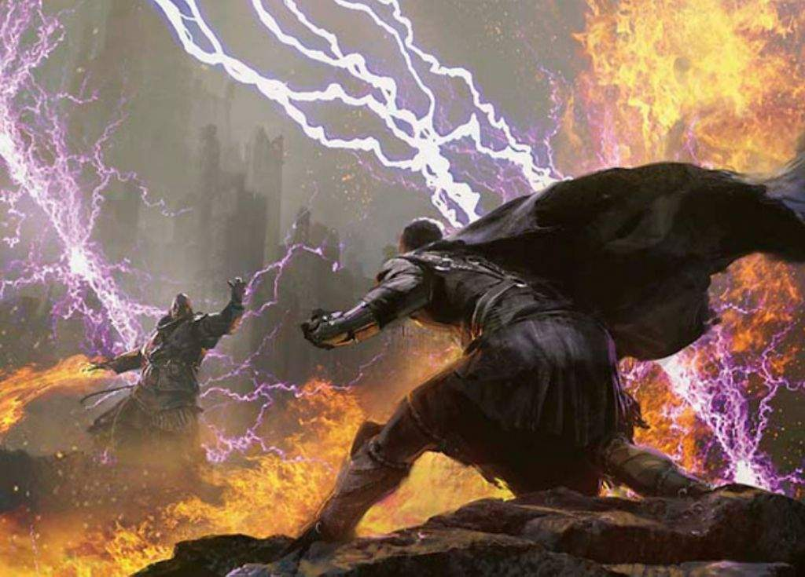

*"Arcane Melee", &copy;2013, Jaime Jones &commat; Wizards of the Coast*

# **The Mythril Forge**
> Welcome, traveler.
> Take off your coat, rest your legs&hellip;
> Stay a while.

This GitHub repository is a part of a larger overarching homebrew project called [**the Mythril Forge**](https://github.com/mythril-forge).
Just in case you don't know, *homebrew* is more of a colloquial term for unofficial modifications to a game.
This really doesn't have anything to do with bars, brews, or beers.
Sorry.

**The Mythril Forge** a fanmade passion project for the game, [Dungeons &amp; Dragons *(5th Edition)*](https://dnd.wizards.com) by Wizards of the Coast.
Surely you know all about this game if you stumbled here&hellip;
And if you somehow didn't, you would have checked out that website!

# Homebrew Spells
This particular repo contains all sorts of specialty homebrew for magic abilities and spells in D&amp;D 5e.
Some of the [most noticeable changes](#changes-to-cantrips) made here include at-will cantrips (level zero spells).
On the other hand, many other spells have been modified only slightly (or not at all).
In this case, they were deemed high enough quality as they were.

## :beginner: Getting Started
To get started with this repository, just check out the [`spells/`](https://github.com/mythril-forge/homebrew-spells/tree/master/spells) folder.

Specific changes are detailed in each spell's entry.
If an entry does not exist (such as *chill touch*), then the spell has either been moved to a different level, renamed, or is no longer available.
In this case, I recommend searching for the spell using GitHub's search bar.

If you find something you dislike&mdash;whether its a mechanical opinion or a flourish of english&mdash;please [create an issue](https://github.com/mythril-forge/homebrew-spells/issues) on this project.
Better yet, you can make a change to this project yourself!
Go ahead and fork this project, make changes, then [create a pull request](https://github.com/mythril-forge/homebrew-spells/pulls).

## :chart_with_upwards_trend: Completion Status
Some of D&D's most diverse and deep character options are the spells themselves.
Eight out of twelve classes have magic built into their core features, and the other four can gain magic in other ways.
There are over 500 spells in this game.
With that in mind, this particular subproject has to be split into more digestable chunks.
Intuitively, each tier of magic can be managed in their own branch.
That means there are ten branches in this repo that represent the ten tiers of magic.

To rate this project's completion, marks of quality are attributed to each spell entry.
Those marks of quality assurance are outlined below:
- :shit: this entry is unacceptable.
- :x: this entry has not been modified.
- :dizzy: this entry has been modified, but has not been reviewed for QA.
- :sparkles: this entry's mechanics has been personally reviewed and validated once for quality assurance.
- :star: this entry's mechanics have been cross-checked with other similar spells for consistancy assurance.
- :star2: this entry has been reviewed by at least three different people other than myself.
- :stars: this entry has a dedicated blogpost about its changes.
- :white_flower: this entry is virtually perfect, and gets all the QA.

Furthermore, each branch mentioned earlier is rated based on the lowest-rated spell entry stored there.
Here is that outline:

#### Spell Tier QA
| Spell Category | QA Mark    |
|:--------------:|:----------:|
| cantrips       | :sparkles: |
| level-1 spells | :dizzy:    |
| level-2 spells | :dizzy:    |
| level-3 spells | :dizzy:    |
| level-4 spells | :x:        |
| level-5 spells | :x:        |
| level-6 spells | :x:        |
| level-7 spells | :x:        |
| level-8 spells | :x:        |
| level-9 spells | :x:        |

## Changes to Cantrips
Cantrips have been substantially changed from the original 5e ruleset.

Each class no longer is tethered with an arbitrary number of cantrips that they can learn.
Instead, the spells that each class can respectively learn is increased, and cantrips can be learned/prepared alongside all other spells of 1st-level and higher.

A cantrip's power no longer scales with character level.
Instead, a character can upcast a cantrip by casting it using a spell slot of 1st-level or higher.

Many cantrips now have a casting time of a bonus action.
However, with **the Mythril Forge** ruleset, an action can be used to take a bonus action.
This does mean that a caster can almost always fill their bonus action slot with a free cantrip.
Likewise, many cantrips can be shot twice in one turn.

Finally, all spellcasters have access to cantrips.
That includes half-casters like paladin and ranger.
A small selection of cantrips have been extended to allow these classes some spellcasting.

## Changes to Saving Throws
Saving throws are complicated.
Especially those gosh darned Wisdom Saving Throws.
Ya can't live with them, and ya can't live without them.
What are you going to do?
Am I right?
Well&hellip;
I'll tell you what I'll do.
I'll give them the makeover that they deserve!

### Traditional Trends
Okay, so in earlier editions, there was no Wisdom Saving Throw.
Nor was there a Dexterity Saving Throw.
Or Intelligence Saving Throw, or Constitution.
None of that!
There were Fortitude, Reflex, and Will saves.
Nowadays, those map to Constitution, Dexterity, and Wisdom saves.

Because of this, there's a sort of idea about "strong" saving throws and "weak" saving throws.
The game was designed around the fact that Constitution, Dexterity, and Wisdom have the best saves.
Strength, Intelligence, and Charisma were just not used all that often.
That was all on purpose.
Seems like it works pretty okay.

### Looking to the Future
Still, the difference between saves&mdash;especially between different mental saves&mdash;is totally fuzzy and unclear.
Since this repository is all about overhauling spells, this concept is an important one to tackle.
Will we change what saves go where?
Will we keep them how they are?
How will we keep balance with strong vs. weak saves?
What does a Wisdom Saving Throw mean?
What does an Intelligence Saving Throw mean?
etc.

### Strength Saving Throws
Strength saves are easy to remember; its all about that bass.
Examples include:
- overcoming strong winds
- enduring huge impacts and forces
- breaking heavy restraints
- holding onto equipment

Overall, its Strength Saves apply to a pretty limited list of use-cases.
As we discussed before, that was totally on purpose.
However, they are easy enough to understand that few opinions ever stray from this conceptual path.

### Dexterity Saving Throws
Dexterity saves encompass a *huge* number of damage-dealing spells.
Luckily, although they are massively prevalant, it is mostly used to avoid damage.
Avoid this rock.
Dodge that fire.
We've heard it all.
Examples include:
- dodging massive areas of effects
- keeping balance in difficult areas
- slipping out of wierd situations

### Constitution Saving Throws
Once you have a grasp on what this ability represents, Constitution Saving Throws kinda make sense.
It's about your immune system, your endurance, your tolerance to a variety of ambiant effects.
The difficulty with this is categorizing Constitution checks versus Constitution saving throws.
I believe a saving throw is made to avoid an adverse effect happening to you, or do nothing.
An ability check is made avoid failing a desireable activity (possibly taking an adverse effect), or follow through that activity (do nothing extra).
Examples include:
- enduring lack of oxygen
- enduring poisoned air
- enduring poisoned attacks
- resisting extreme temperatures
- maintaining focus in (physically) distracting environments

<!--

---

# Markdown Rules
## Size Categories
Size categories are always written in italics as a mechanic indicator, like so: `*size*`. There are six size categories in total:
- *Tiny*
- *Small*
- *Medium*
- *Large*
- *Huge*
- *Gargantuan*

## Conditional Effects
**conditioned**

## Spell References
[*spell name*](./)

## Dice Rolls
### Regular Roll
…roll `??d??`…on a success…on a failure…

### Coin Flip
…flip `a coin`…on a heads…on a tails…

## Quoutes &amp; Sidebars
> I like quotes.
> 
> &mdash;Jim Darkmagic

&hellip;more description text&hellip;

> Creator commentary &amp; important rules

## Bulleted Lists
Some general instructions:
- A line item can be a full sentance.
- If a line item has multiple sentances, it must have a new line.
	The new line is always led by a tab (`\t`) character.
- Occasionally, an item will have further bullet notes itself:
	- It might look like this.
	- Or like this.
		A nested bullet can also have several sentances.
- And these sentances can always be escaped out one way or the other.

Bullets can occasionally take on one or two words (one preferred):
- ice
- fire
- water

You might notice that a bulleted list of any kind is always led by a sentance ending in a colon (`:`).

--->
